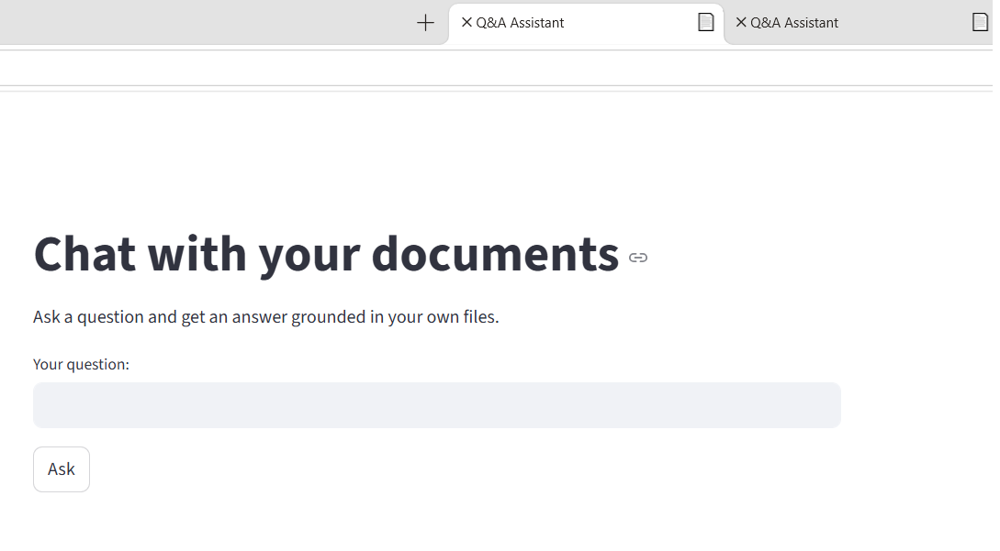
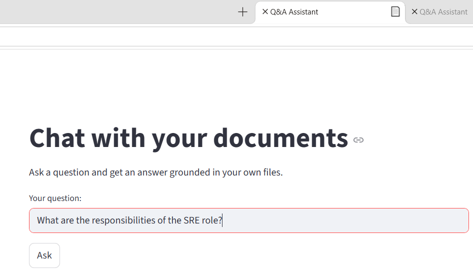
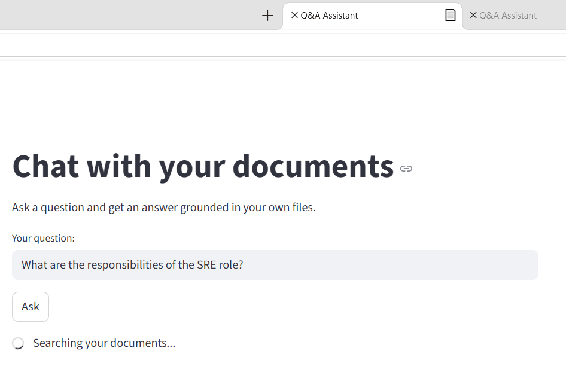
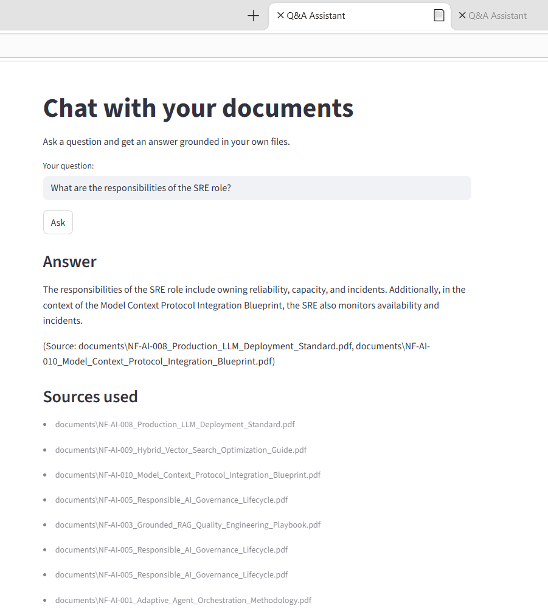

# Q&A Assistant - Chat With Your Documents
A Retrieval-Augmented Generation (RAG) app that answers questions
about your own documents and cites its sources.


## What it does
- Loads PDF and text files, splits them into chunks, and indexes
them in a Chroma vector database using OpenAI embeddings.
- Retrieves the most relevant chunks for a question and asks an LLM
to answer using only that context.
- Provides a Streamlit interface and an evaluation script.

## Tech
LangChain, Chroma, OpenAI, Streamlit, Python.

## How to run
1. Create a virtual environment and `pip install -r requirements.txt`
2. Add an `.env` file with `OPENAI_API_KEY=...`
3. Put documents in the `documents/` folder
4. `python chunk_experiment.py` to search chunk sizes, overlaps, and
retrieval depths (`top_k`) against a set of known questions, and save
the best-performing combination to `best_chunk_params.json`
5. `python ingest.py` to build the index, using those best-performing
parameters (or sensible defaults if you want to skip step 4)
6. `python rag.py` to ask a question from the command line and get an
answer with sources, without launching the web app
7. `streamlit run app.py` to launch the app
8. `python evaluate.py` to score answer quality: each answer is graded
PASS/FAIL by a second LLM acting as a judge against a known-correct
reference answer, giving an overall accuracy score

## How it works
Documents are split into overlapping chunks and embedded into a local
Chroma vector store (`ingest.py`). When a question comes in (`rag.py` /
`app.py`), it's embedded the same way, the most similar chunks are
retrieved, and an LLM is prompted to answer using *only* that retrieved
context - citing which source files it drew from, and saying it doesn't
know rather than guessing when the answer isn't in the retrieved
context. `chunk_experiment.py` and `evaluate.py` are the two quality
checks: one measures whether retrieval finds the right evidence, the
other measures whether the final answer is actually correct.

**Answer accuracy:** 17/20 (85%) on a 20-question set grounded in the
project's own documents, graded PASS/FAIL by an LLM judge comparing
each answer to a known-correct reference (`python evaluate.py`,
results saved to `evaluate_results.json`).

```
documents/  →  ingest.py  →  chroma_db/  →  rag.py / app.py  →  answer + sources
                                 ^
                    chunk_experiment.py tunes chunk_size,
                    chunk_overlap, and top_k against this store
```

The screenshots below walk through a full session: the home screen,
typing a question, clicking "Ask", and receiving the answer with its
sources.

**1. Home screen:**


**2. Typing a question:**


**3. Clicking "Ask":**


**4. Answer with sources:**


## What I'd improve next
The Q&A Assistant project always runs the same straight-line pipeline:
retrieve once, then answer. My idea for a follow-up project is a
self-correcting agent built with LangGraph - it retrieves, judges its
own results, rewrites the question and retries if the evidence is
weak, then answers. The agent makes a decision mid-flow: are these
documents good enough? If not, it improves the question and loops
back - a pattern the industry calls self-correcting (or corrective) RAG.
